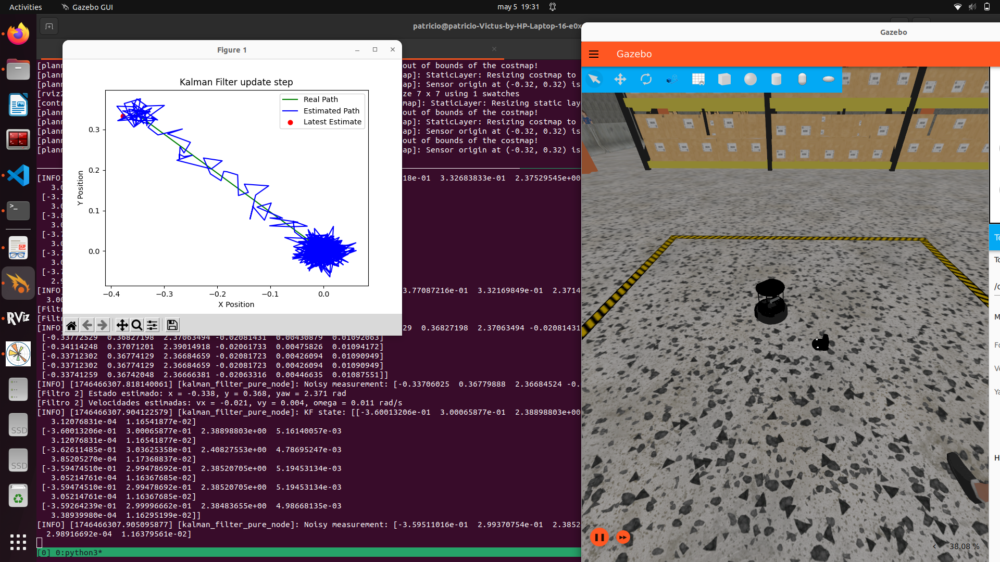

# Práctica 2: Implementación del Filtro de Kalman en ROS 2

Segunda Práctica impartida en la asignatura Ampliación de Robótica de 4º GIERM. 

En esta práctica se implementa un Filtro de Kalman para estimar la posición y velocidad de un robot móvil simulado con ROS 2.

Entrega realizada por Patricio De Mariano Aguilera, DNI: 29555267Z

## Configuración y ejecución
### Instrucciones
1. Clonar repositorio dentro de un workspace:

```bash
git clone https://github.com/PatricioDMA/p2_kf_pda
cd p2_kf_pda
```
2. Construir el paquete:

```bash
colcon build --packages-select p2_kf_adr
source install/setup.bash
```

3. Lanzar la simulación en un terminal:

```bash
ros2 launch turtlebot4_ignition_bringup turtlebot4_ignition.launch.py slam:=true nav2:=true rviz:=true
```

4. En otra terminal, ejecutar el nodo del filtro de Kalman (modelo 1 o modelo 2):


```bash
ros2 run p2_kf_adr kf_estimation
ros2 run p2_kf_adr kf_estimation_vel
```
### Ejecución de Filtro de Kalman 1
Con el fin de demostrar el funcionamiento de ambos filtros, se simularán en el caso de que el ruido sea muy bajo.

Al iniciar la simulación junto al nodo del filtro de kalman 1, tendremos al robot en el soporte de carga (posición de origen de coordenadas):


Para comprobar el correcto funcionamiento de la estimación del ángulo de giro (jaw/theta) se hará una rotación pura sobre el origen de aproximadamente 180º :


Ahora que está casi alineado con el sentido negativo del eje X, se hará una traslación recta para comprobar que la estimación en ese eje funciona correctamente:


A continuación nos intentaremos alinear con el eje Y para comprobar su correcta estimación:


Una vez alineado, se comprueba que tanto ambas coordenadas como el ángulo de giro han permanecido consistentes con lo simulado:


### Ejecución de Filtro de Kalman 2
Al iniciar la simulación se podrán observar las nuevas variables de estado (velocidades lineales y angular) en la posición de origen:


De forma análoga al primer filtro, se empezará con una rotación pura sobre el origen. Esta vez se girarán unos 135º para comprobar la estimación de trayectoria en ambos ejes:


Tras eso, se moverá de forma rectilínea el robot en dos direcciones diferentes para ver la diferencia entre la trayectoria real y la estimada (vista en las gráficas de las imágenes):


## Cambio entre configuraciones de ruido
Como especificado en las instrucciones de la práctica,se han simulado tres configuraciones distintas de ruido para el filtro de Kalman:
- Ruido bajo
- Ruido alto en la medición (Q grande)
- Ruido alto en el proceso (R grande)

Para simular fácilmente cada caso, se deberá acceder al archivo `filters/kalman_filter.py` y comentar/descomentar las siguientes líneas para el filtro 1 y 2 de Kalman respectivamente:
```python
def __init__(self, initial_state, initial_covariance, proc_noise_std = [0.02, 0.02, 0.01], obs_noise_std = [0.02, 0.02, 0.01]): # Ruido bajo
# def __init__(self, initial_state, initial_covariance, proc_noise_std = [0.02, 0.02, 0.01], obs_noise_std = [0.5, 0.5, 0.2]): # Ruido alto en la medición (Q grande)
# def __init__(self, initial_state, initial_covariance, proc_noise_std = [0.5, 0.5, 0.2], obs_noise_std = [0.02, 0.02, 0.01]): # Ruido alto en el proceso (R grande)
```

```python
def __init__(self, initial_state, initial_covariance,
                 proc_noise_std=[0.02]*6, obs_noise_std=[0.02]*6): # Ruido bajo
# def __init__(self, initial_state, initial_covariance,
#              proc_noise_std=[0.02]*6, obs_noise_std=[0.5, 0.5, 0.2, 0.5, 0.5, 0.2]): # Ruido alto en la medición (Q grande)
# def __init__(self, initial_state, initial_covariance,
#              proc_noise_std=[0.5, 0.5, 0.2, 0.5, 0.5, 0.2], obs_noise_std=[0.02]*6): # Ruido alto en el proceso (R grande)
```
Se debe tener en cuenta que la línea de definición de la inicialización debe ir inmediatamente debajo de la clase, por lo que se deberán desplazar los comentarios hacia abajo para evitar errores

## Simulación de cada caso con el filtro completo
Como modus operandi para cada caso, se simulará usando el filtro de Kalman 2 debido a su fácil visualización gráfica
### Caso 1: Ruido bajo
Este caso se muestra por encima en el apartado de ejecución del filtro de Kalman 2, pero para analizarlo se necesitará la gráfica final obtenida:


Durante la simulación se puede comprobar cómo la estimación se acerca mucho a la realidad al principio del movimiento, pero cuanto más tiempo pase el robot moviéndose en una sola dirección, más error se va acumulando que afecta al resto de la trayectoria. Esto tiene sentido que ocurra con ambos ruidos R y Q bajos, ya que le estamos dando el mismo peso en la estimación a la predicción que a la actualización. Nuestro modelo es una simplificación lineal de la cinemática diferencial del Turtlebot, cosa que introduce errores sistemáticos y hace que el modelo sea más adecuado a tiempos cortos y velocidades pequeñas; mientras que nuestros sensores son más confiables.

### Caso 2: Ruido alto en la medición
Para este caso se simulará un escenario parecido al caso anterior, empezando por el origen:


Primero se realizará una rotación hasta quedar en diagonal hacia la izquierda (~135º):


Después se moverá el robot en línea recta durante cierto tiempo:


Por último, se girará y desplazará para terminar el trayecto:


En este caso se puede observar que, a pesar de que durante el movimiento de punto a punto pueda ser más preciso que en el caso anterior; introducir un ruido alto en la medición hace que se acumule incluso más error durante la trayectoria. Esto se explica de forma parecida al primer caso, ya que se está confiando aún más en nuestro modelo simplificado y linealizado diciendo que las medidas de nuestros sensores no son muy de fiar. Esto logra un resultado que es igual o peor que cuando ambos ruidos son bajos.

### Caso 3: Ruido alto en el proceso
Como de costumbre, se simulará una trayectoria parecida a los casos anteriores empezando desde el origen:


La primera traslación se dará en un ángulo similar al ya visto anteriormente:



La segunda traslación dejará al robot en el punto final de este análisis:


Al ver el resultado de esta simulación, parece ser evidente que el filtro de Kalman 2 con nuestros modelos se comporta mucho mejor en este caso que en los dos anteriores. A pesar de pegar pequeños bandazos durante el movimiento del robot debido a las actualizaciones, las coordenadas estimadas están mucho más cerca de las reales que en otros casos y el punto final real y estimado acaban aproximadamente en la misma zona. Esto se debe a que, como mencionado en el primer caso, el modelo utilizado para el filtro no está tan alineado con la realidad como las medidas y el modelo de observación de nuestro filtro. Al introducir ruido en el proceso se le da mucho más peso a la medición, haciendo que el resultado de la estimación sea por un margen considerable el más preciso que se ha simulado.
